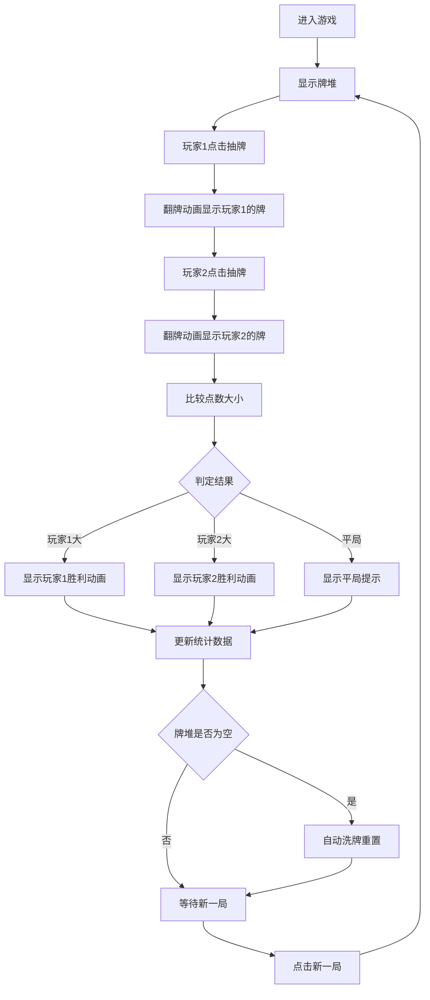

## 1. 产品概述

抽牌比大小是一款面向手机用户的休闲小游戏，供两人在等待时快速决出胜负。游戏基于一副标准扑克牌，双方轮流点击抽牌，通过比较点数大小判定胜负。

- 目标用户：需要快速简单游戏来打发时间或决出胜负的两个人
- 核心价值：操作简单、即时反馈、无需安装即可使用

## 2. 核心功能

### 2.1 功能模块
1. **游戏主页面**：牌堆展示、双方抽牌区域、胜负结果展示、新一局按钮、胜率统计

### 2.2 页面详情
| 页面名称 | 模块名称 | 功能描述 |
|-----------|-------------|---------------------|
| 游戏主页面 | 牌堆区域 | 中央显示背面朝上的扑克牌，点击触发抽牌动画并随机发放一张牌 |
| 游戏主页面 | 玩家区域 | 左右两侧分别展示双方玩家的手牌，包含翻转动画 |
| 游戏主页面 | 结果展示 | 胜负判定后显示胜利/失败/平局的动画效果和文字提示 |
| 游戏主页面 | 控制按钮 | 新一局按钮，点击清空牌面重新开始 |
| 游戏主页面 | 统计区域 | 显示双方胜负次数、胜率百分比，数据本地持久化 |

## 3. 核心流程

玩家进入游戏后，中央显示牌堆。第一位玩家点击牌堆抽牌，牌翻转显示点数和花色。然后第二位玩家点击牌堆抽牌。系统自动比较两张牌的点数，展示胜负结果动画。玩家点击"新一局"按钮清空牌面开始下一轮。当牌堆中的牌被抽空（52张用完），自动洗牌重新开始。所有胜负数据记录在本地存储中。

## 4. 用户界面设计

### 4.1 设计风格
- 主色调：深绿色（牌桌感）+ 金色点缀（胜利感）
- 按钮风格：圆角、微立体、点击有按压反馈
- 字体：使用优雅的衬线字体展示点数，无衬线字体展示说明文字
- 布局风格：居中对称布局，左右两侧为玩家区域，中央为牌堆
- 图标/emoji：使用扑克牌花色符号（♠♥♦♣）

### 4.2 页面设计概述
| 页面名称 | 模块名称 | UI 元素 |
|-----------|-------------|-------------|
| 游戏主页面 | 牌堆区域 | 3D倾斜扑克牌背面、悬浮阴影、点击翻转动画 |
| 游戏主页面 | 玩家区域 | 手牌卡片、翻转显示动画、玩家标签 |
| 游戏主页面 | 结果展示 | 胜利金色光效、抖动动画、结果文字渐变 |
| 游戏主页面 | 控制按钮 | 半透明毛玻璃按钮、悬浮放大效果 |
| 游戏主页面 | 统计区域 | 简洁数据面板、胜率进度条 |

### 4.3 响应式
- 桌面端优先设计，自适应移动端
- 移动端优化触控区域，确保按钮和牌堆点击区域足够大
- 横竖屏适配，保证在不同屏幕尺寸下布局合理
