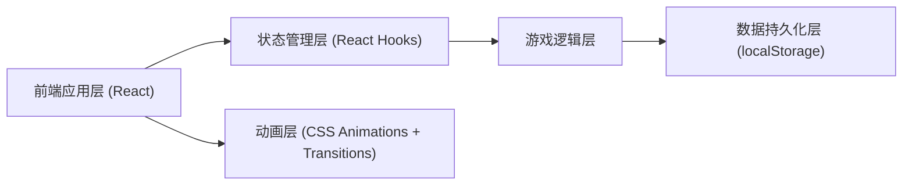

## 1. 架构设计



## 2. 技术描述

- 前端：React@18 + tailwindcss@3 + vite
- 初始化工具：vite-init
- 后端：无（纯前端应用）
- 数据存储：localStorage（本地存储胜负统计数据）

## 3. 路由定义

| 路由 | 用途 |
|-------|---------|
| / | 游戏主页面 |

## 4. 数据模型

### 4.1 扑克牌数据结构

```typescript
interface Card {
  suit: 'spades' | 'hearts' | 'diamonds' | 'clubs'; // 花色：黑桃、红桃、方块、梅花
  value: number; // 点数：1-13 (A=1, 2-10, J=11, Q=12, K=13)
  displayValue: string; // 显示值：A, 2-10, J, Q, K
}
```

### 4.2 游戏状态数据结构

```typescript
interface GameState {
  deck: Card[]; // 当前牌堆
  player1Card: Card | null; // 玩家1的牌
  player2Card: Card | null; // 玩家2的牌
  currentTurn: 'player1' | 'player2' | 'result'; // 当前阶段
  result: 'player1_win' | 'player2_win' | 'draw' | null; // 结果
}
```

### 4.3 统计数据结构

```typescript
interface Statistics {
  player1Wins: number;
  player2Wins: number;
  draws: number;
  totalGames: number;
}
```

## 5. 核心模块

### 5.1 牌堆管理模块
- 创建52张标准扑克牌
- Fisher-Yates 洗牌算法
- 抽牌逻辑（从牌堆中移除并返回）
- 牌堆空检测与自动重置

### 5.2 游戏控制模块
- 回合管理（玩家1 -> 玩家2 -> 结果展示）
- 胜负判定逻辑（比较点数大小）
- 新一局重置逻辑

### 5.3 统计模块
- localStorage 读写
- 胜率计算
- 数据初始化与持久化

### 5.4 动画模块
- 卡牌翻转动画（CSS 3D transform）
- 胜负结果动画（缩放、发光、抖动）
- 牌堆点击反馈
